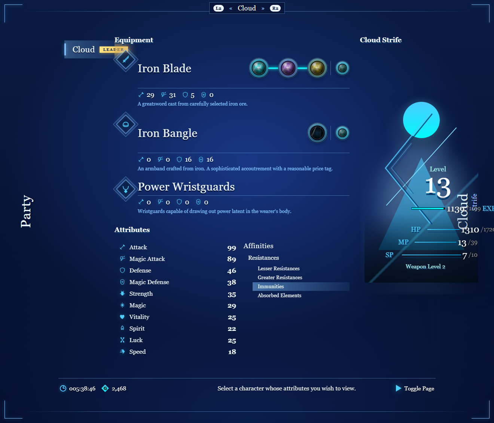
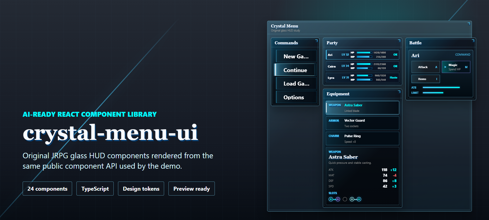
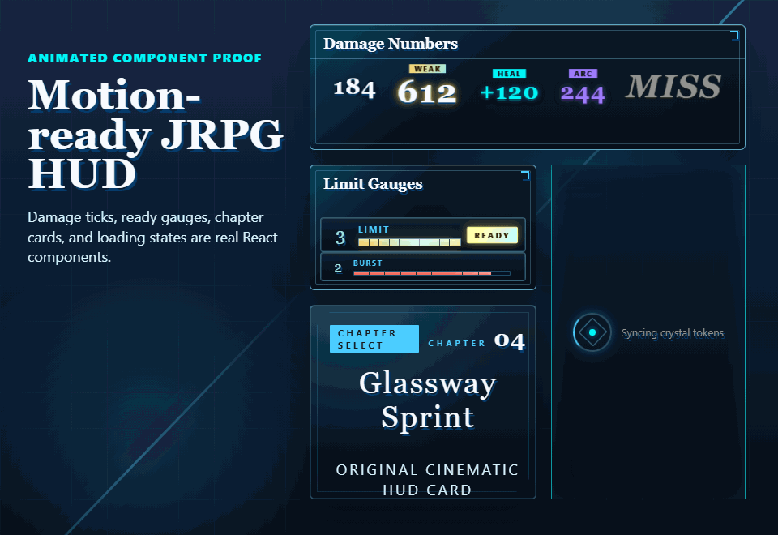
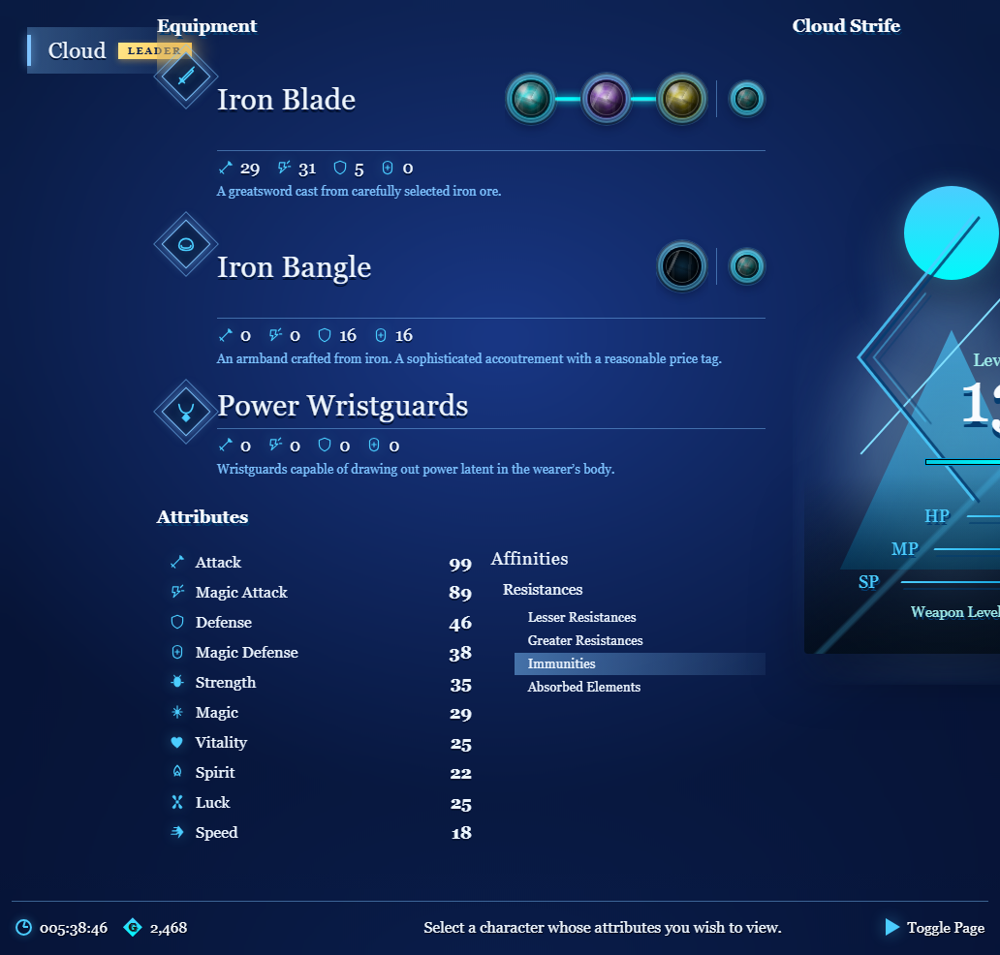
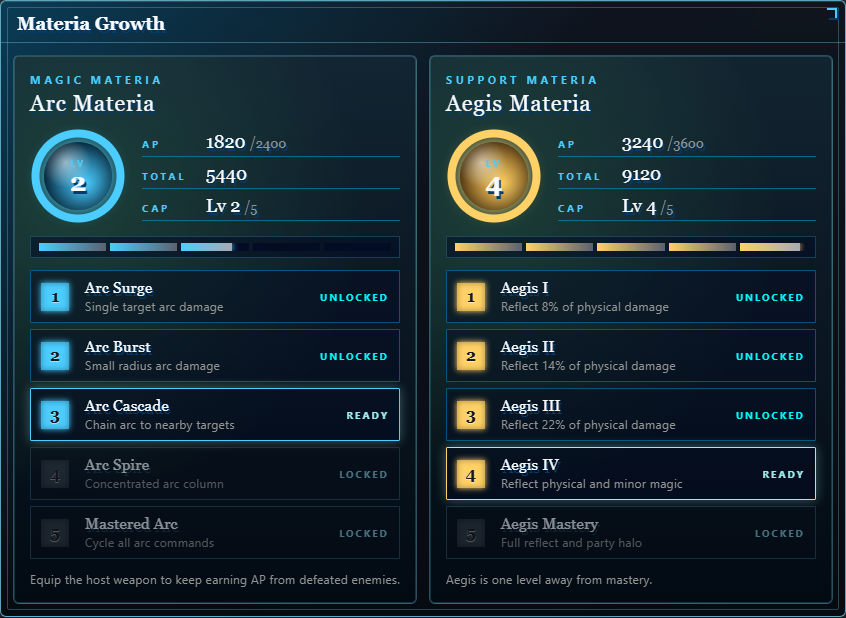
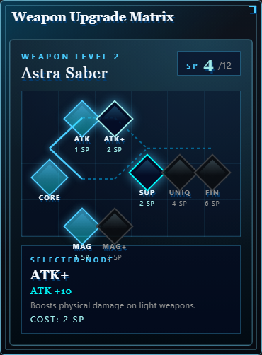
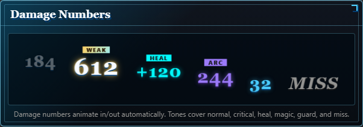
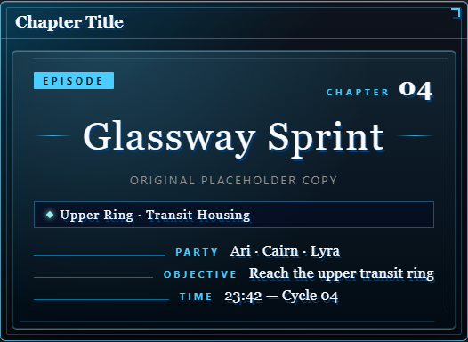
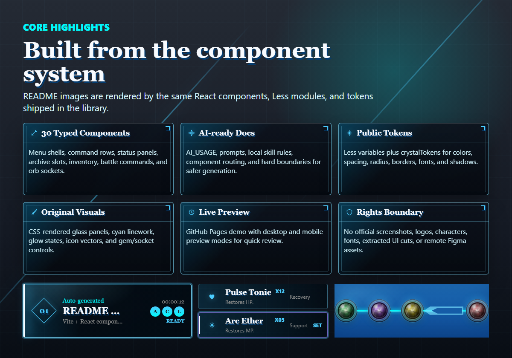
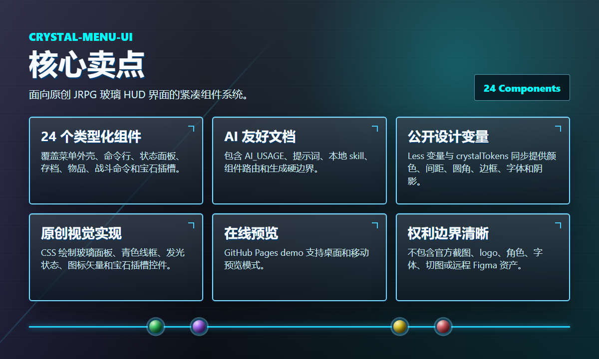

<div align="center">

# crystal-menu-ui

### Final Fantasy VII Remake-inspired JRPG Glass HUD UI Kit for React
### 最终幻想 VII Remake 风格 JRPG 玻璃 HUD 组件库（React + TypeScript）

[](https://www.npmjs.com/package/crystal-menu-ui)
[](https://www.npmjs.com/package/crystal-menu-ui)
[](https://github.com/zq52xy/crystal-menu-ui/stargazers)
[](LICENSE)

[](#components-30--组件)
[](https://react.dev)
[](https://typescriptlang.org)
[](https://vite.dev)
[](AI_USAGE.md)
[](FIGMA_REFERENCE.md)
[](#)



</div>

**`crystal-menu-ui`** is an original, MIT-licensed React + TypeScript component library that recreates the visual language of *Final Fantasy VII Remake*'s in-game UI — dark blue glass panels, cyan linework, materia orb sockets, angular HUD frames, and humanist Optima-style typography — as **30 reusable components** ready to drop into any JRPG, RPG, fantasy, sci-fi, or game-style web project. It ships AI-ready component documentation, a Figma-derived design tokens system, a flagship bright-blue **Equipment Screen** demo composition, opt-in motion (looped damage numbers, animated chapter cards, ready-pulse limit gauges), and full bilingual docs in English and 简体中文 — explicitly framed as an unofficial fan study project, not an official Square Enix asset.

**`crystal-menu-ui`** 是一套基于 MIT 许可的原创 React + TypeScript 组件库，把《最终幻想 VII Remake》游戏 UI 的视觉语言——深蓝玻璃面板、青色线条、魔晶石宝石轨、菱形 HUD 框、衬线感的 Optima 字体——重建为 **30 个可复用组件**，可直接嵌入任意 JRPG / 角色扮演 / 奇幻 / 科幻 / 游戏风格的 Web 项目。库本体附带面向 AI 的组件文档、来自 Figma 的设计变量系统、明亮宝蓝风格的 **Equipment Screen 装备屏 demo**、可选的动画体系（循环伤害数字、章节卡入场、极限槽脉冲）以及全中英双语文档——本项目明确定义为非官方粉丝学习项目，与 Square Enix 等任何权利方无关。

> [!IMPORTANT]
> **Unofficial learning project · 非官方学习项目**
>
> This is a free learning and demonstration project. It is **not affiliated with, endorsed by, or sponsored by any game publisher, studio, owner, or rights holder**.
>
> This package does **not** redistribute official screenshots, logos, characters, fonts, music, icons, textures, extracted UI cuts, exact vector paths, or remote Figma assets. The implementation is original React + Less code that studies broad interface patterns from a source Figma component library.
>
> The MIT license covers **this project's code only**. It does not grant any rights to third-party trademarks, game IP, official art, names, or proprietary visual assets. If you reuse this project, especially for commercial work, you are responsible for your own IP and trademark review.
>
> 本项目为免费学习和演示用途，**不隶属于任何游戏发行方、工作室、所有者或权利方，也不代表任何官方授权、背书或赞助**。
>
> 本包**不分发**官方截图、logo、角色、字体、音乐、图标、贴图、切图、精确矢量路径或远程 Figma 资产。代码是原创 React + Less 实现，只从来源 Figma 组件库中研究通用界面语言。
>
> MIT 许可仅覆盖**本项目代码**，不授予任何第三方商标、游戏 IP、官方美术、名称或专有视觉资产的使用权。任何复用，尤其是商业用途，都需要使用者自行完成 IP 和商标风险审查。

### About this project / 关于本项目

`crystal-menu-ui` is a long-form study of the question: *what would the Final Fantasy VII Remake equipment, party, and battle UIs look like as a clean, typed React component library?* It studies the in-game **dark blue glass panel hierarchy**, **angular cyan corner brackets**, **materia / orb socket motifs**, **Lv-13-style diagonal stat shelves**, **chapter title / chapter results cards**, **floating damage numbers**, **limit gauges**, **save / load archive rows**, and **Optima-led humanist typography** — and turns each pattern into an isolated, prop-driven, theme-friendly React component that an LLM or human builder can compose into a complete JRPG menu screen in a few lines.

Because every component is rebuilt from scratch in CSS and SVG, the package can be MIT-licensed and shipped to npm without redistributing official screenshots, logos, character art, fonts, or extracted vector paths. The repository ships matching AI documentation (`AI_USAGE.md`, `PROMPT.md`, `DESIGN_PROMPT.md`, `skill/SKILL.md`) so an AI assistant can produce a Final Fantasy-style menu using the public component API without inventing branded assets.

`crystal-menu-ui` 是一次完整的设计研究：*如果用一套干净、强类型的 React 组件库来重建《最终幻想 VII Remake》中的装备屏、队伍菜单和战斗 UI，会长什么样?* 仓库系统性研究了游戏中的**深蓝玻璃面板层级**、**菱形青色角框**、**魔晶石 / 宝石插槽语言**、**Lv 13 斜线属性轨**、**章节标题 / 结算卡**、**浮动伤害数字**、**极限技能槽**、**存档行**与 **Optima 衬线字体** —— 每一个模式都被独立成一个 prop 驱动、可换肤、可被 AI 或人类一行行组合的 React 组件。

由于所有组件都是用 CSS + SVG 从头实现，整个包可以以 MIT 许可发布到 npm，**完全不分发**官方截图、logo、角色立绘、字体或矢量路径。仓库还提供了配套的 AI 文档（`AI_USAGE.md`、`PROMPT.md`、`DESIGN_PROMPT.md`、`skill/SKILL.md`），让 AI 助手能在不"幻觉"出品牌资产的前提下，基于公开组件 API 生成一个完整的最终幻想风格菜单。

### Search Keywords / 搜索关键词

- **English component-library keywords:** Final Fantasy UI components, Final Fantasy VII Remake UI kit, FF7R UI clone, FF7 menu components, JRPG UI library, JRPG menu React library, JRPG glass HUD React components, materia orb React component, RPG status bar React, fantasy game UI components, anime game UI library.
- **English design-language keywords:** dark blue glass UI, cyan linework UI, angular menu HUD, holographic glass HUD, sci-fi RPG menu, Optima font menu, blue glass equipment screen, JRPG status panel, RPG character profile React.
- **English use-case keywords:** game web menu, indie RPG UI starter, fan game UI kit, MMO inspector UI, RPG character sheet web, web RPG companion app UI, AI-generated JRPG menu, GPT JRPG UI generator.
- **中文组件库关键词：** 最终幻想 UI、最终幻想 7 重制版 UI、FF7 重制版界面、FF7R 组件库、JRPG 组件库、最终幻想风格菜单组件、最终幻想风格 React 组件、JRPG 玻璃 HUD React 组件、魔晶石宝石 React 组件、RPG 状态栏 React。
- **中文设计语言关键词：** 深蓝玻璃 UI、青色边框 UI、菱形 HUD、科幻 RPG 菜单、玻璃质感装备屏、JRPG 状态面板、Optima 字体菜单、衬线 RPG UI。
- **中文使用场景关键词：** 游戏 Web 菜单、独立 RPG UI 启动包、同人游戏 UI 套件、MMO 信息面板、RPG 角色卡 Web、Web RPG 配套 App UI、AI 生成 JRPG 菜单、GPT JRPG UI 生成器。

> These keywords describe learning, reference, and search intent only. They are not official product names, affiliation claims, or asset licenses.
>
> 以上关键词仅用于说明学习参考和搜索意图，不代表官方产品名、授权关系或素材许可。



### 🔗 Preview

- **Online Preview (PC):** [crystal-menu-ui](https://zq52xy.github.io/crystal-menu-ui/) — full demo gallery, including the bright-blue Equipment Screen, Materia Growth panels, Weapon Upgrade Matrix, looping Damage Numbers, Limit Gauges, Chapter Intro / Results cards, and the full 30-component gallery.
- **Online Preview (Mobile):** [crystal-menu-ui-mobile](https://zq52xy.github.io/crystal-menu-ui/?preview=mobile) — same gallery in 390 px layout.
- **Component Docs:** [All 30 components](#components-30--组件) — component map, code examples, and props contract.
- **Showcase:** [Highlights / 核心卖点](#highlights--核心卖点) — menu screens, HUD panels, archive slots, inventory surfaces, materia growth, weapon upgrade matrix, and chapter cinematics.
- **Source Figma:** [Final Fantasy VII Remake UI Kit and Prototypes (Community Copy)](https://www.figma.com/design/GjQLMKKW4sLALp3auVsSqG/Final-Fantasy-VII-Remake-UI-Kit-and-Prototypes--Community---Copy-?node-id=1-3&t=NbDcbMPlhTXk572y-1) — visual-language reference; not bundled.

### 🔗 预览

- **在线预览（PC）：** [crystal-menu-ui](https://zq52xy.github.io/crystal-menu-ui/) —— 完整 demo 画廊，包含明亮宝蓝装备屏、魔晶石升级面板、武器升级矩阵、循环伤害数字、极限槽、章节开场 / 结算卡，以及完整 30 个组件画廊。
- **在线预览（Mobile）：** [crystal-menu-ui-mobile](https://zq52xy.github.io/crystal-menu-ui/?preview=mobile) —— 390 px 移动端版本。
- **组件文档：** [全部 30 个组件](#components-30--组件) —— 组件地图、代码示例和 Props 契约。
- **效果展示：** [核心卖点 / Highlights](#highlights--核心卖点) —— 菜单屏、HUD 面板、存档行、物品界面、魔晶石升级、武器矩阵、章节卡。
- **来源 Figma：** [Final Fantasy VII Remake UI Kit and Prototypes (Community Copy)](https://www.figma.com/design/GjQLMKKW4sLALp3auVsSqG/Final-Fantasy-VII-Remake-UI-Kit-and-Prototypes--Community---Copy-?node-id=1-3&t=NbDcbMPlhTXk572y-1) —— 视觉语言参考，不打包。

> The GitHub Pages links update after each `npm run deploy`. If the live preview is older than the latest commit, run `npm run deploy` from a clone to refresh `demo-dist`.
>
> GitHub Pages 预览链接在每次执行 `npm run deploy` 后更新。如果发现在线预览比当前 commit 旧，clone 仓库后执行 `npm run deploy` 即可重新发布 `demo-dist`。

---

## Use, Share, or Showcase / 使用、分享或展示作品

<p align="center">
  
</p>

Use the package, share the visual assets, or open a showcase issue if it helps you build JRPG, RPG, game HUD, or AI-generated menu interfaces faster. Stars are welcome, but useful demos, feedback, and showcases are even more valuable for the project.

如果这个项目能帮你更快搭建 JRPG / RPG / 游戏 HUD / AI 生成菜单界面，可以直接使用、分享配图，或者提交一个 Showcase issue。Star 当然欢迎，但真实 demo、反馈和作品展示对项目更有价值。

- **Star:** [github.com/zq52xy/crystal-menu-ui](https://github.com/zq52xy/crystal-menu-ui)
- **Live demo:** [zq52xy.github.io/crystal-menu-ui](https://zq52xy.github.io/crystal-menu-ui/)
- **npm:** [npmjs.com/package/crystal-menu-ui](https://www.npmjs.com/package/crystal-menu-ui)
- **Social preview asset:** use `docs/img/banner.png` for posts, release notes, and the GitHub repository social preview.
- **Launch kit:** use [`docs/launch/community-launch-kit.md`](docs/launch/community-launch-kit.md) for ready-to-post launch copy and community checklists.
- **GitHub settings checklist:** use [`docs/launch/github-settings-checklist.md`](docs/launch/github-settings-checklist.md) for topics, social preview, release, and pinned issue setup.
- **AI citation entry:** [`llms.txt`](llms.txt) summarizes the project for AI search and answer engines.
- **Showcase your build:** open a [Showcase issue](https://github.com/zq52xy/crystal-menu-ui/issues/new?template=showcase.yml) if you use the library in a project or AI-generated screen.
- **Contribute safely:** issue and PR templates guide contributors through visual evidence, docs updates, and rights-boundary checks.
- **Suggested topics:** `react`, `typescript`, `component-library`, `game-ui`, `jrpg`, `rpg-ui`, `design-system`, `ai-ready`, `vite`.

## Motion Showcase / 动效展示

<p align="center">
  
</p>

The GIF is generated from real React components: looping damage numbers, ready limit gauges, a cinematic chapter card, and the crystal loading state.

这张 GIF 由真实 React 组件生成：循环伤害数字、Ready 极限槽、章节卡入场和水晶加载态。

## Visual Gallery / 视觉画廊

These screenshots are generated from the public demo and use original CSS/SVG visuals only. They are safe to reuse in posts, release notes, and community submissions.

这些截图来自公开 demo，只使用原创 CSS / SVG 视觉。可以用于社区帖子、release notes 和项目介绍。

<table>
<tr>
<td width="50%"><br /><strong>Equipment Screen</strong></td>
<td width="50%"><br /><strong>Materia Growth</strong></td>
</tr>
<tr>
<td width="50%"><br /><strong>Weapon Matrix</strong></td>
<td width="50%"><br /><strong>Damage Numbers</strong></td>
</tr>
<tr>
<td colspan="2"><br /><strong>Chapter Card</strong></td>
</tr>
</table>

## Highlights / 核心卖点

<p align="center">
  
</p>

<p align="center">
  
</p>

- **30 typed React components** spanning menu shells, command lists, dialogs, HUD metadata, party status, archive slots, inventory panels, battle commands, materia growth panels, weapon upgrade matrices, chapter cinematics, and floating combat damage indicators.
- **Equipment Screen demo** — a complete bright-blue glass HUD composition in `src/demo/App.tsx` that mirrors the source method's flagship equipment surface, composed entirely from existing public components plus a small wrapper.
- **Optima-led typography** — both display and body tokens lead with `Optima`; the package never bundles a font binary, but a gitignored local-only injection slot lets the demo preview the real face on any platform.
- **Original CSS-rendered visuals**: dark / bright dual glass surfaces, cyan and gold linework, glow states, custom inline-SVG icons, materia orb sockets, weapon SP nodes, and damage-number loops.
- **Opt-in motion** — `DamageNumber loop`, `LimitGauge ready` pulse, `ChapterIntroCard` / `ChapterEndCard` entrance animations; all motion respects `prefers-reduced-motion`.
- **AI-ready documentation** with component routing, prompt files, hard boundaries, and local skill instructions.
- **Public design tokens** through Less variables and the TypeScript `crystalTokens` export.
- **Demo-driven QA** with desktop, mobile, and mobile-preview visual smoke screenshots.

- **30 个带类型的 React 组件**，覆盖菜单外壳、命令列表、弹窗、HUD 元信息、队伍状态、存档列表、物品面板、战斗命令、魔晶石升级面板、武器升级矩阵、章节开场 / 结算卡和浮动战斗伤害数字。
- **Equipment Screen 装备屏 demo** —— `src/demo/App.tsx` 中包含一个完整的明亮宝蓝玻璃 HUD 复合界面，复刻来源界面的旗舰装备屏，整屏由现有公开组件 + 一个轻量 wrapper 拼成。
- **Optima 衬线字体优先** —— display 和 body token 都以 `Optima` 起头；包本身不打包任何字体文件，但 demo 配套了 gitignored 的本地字体注入槽，可以让真 Optima 在任何平台上预览。
- **原创 CSS 视觉**：暗色 / 明亮双玻璃面板系统、青色与金色线条、发光态、自绘内联 SVG 图标、魔晶石宝石轨、武器 SP 节点、伤害数字循环。
- **可选动画**：`DamageNumber loop`、`LimitGauge ready` 脉冲、`ChapterIntroCard` / `ChapterEndCard` 入场动画；所有动画都尊重 `prefers-reduced-motion`。
- **面向 AI 的文档体系**：组件路由、提示词文件、硬边界和本地 skill 指令。
- **公开设计变量**：Less 变量和 TypeScript `crystalTokens` 导出。
- **Demo 驱动 QA**：桌面、移动端和移动预览链接的视觉烟测截图。

---

## Installation / 安装

```bash
npm install crystal-menu-ui
```

```tsx
import 'crystal-menu-ui/style'
```

---

## Quick Start / 快速开始

```tsx
import {
  MenuPanel,
  OrbGem,
  OrbSocketRail,
  SaveSlot,
} from 'crystal-menu-ui'
import 'crystal-menu-ui/style'

export default function App() {
  return (
    <div style={{ background: '#17191e', padding: 40, minHeight: '100vh' }}>
      <MenuPanel title="Orb Socket Rail" variant="deep" density="compact">
        <OrbSocketRail
          sockets={[
            { id: 'green', tone: 'green', linkedAfter: 'short' },
            { id: 'violet', tone: 'violet', linkedAfter: 'short' },
            { id: 'gold', tone: 'gold', linkedAfter: 'brace' },
            { id: 'red', tone: 'red' },
          ]}
        />

        <div style={{ display: 'flex', gap: 12, marginTop: 12 }}>
          <OrbGem tone="green" size="md" label="Green orb" />
          <OrbGem tone="violet" size="md" label="Violet orb" />
          <OrbGem tone="gold" size="md" label="Gold orb" />
          <OrbGem tone="red" size="md" label="Red orb" />
        </div>

        <SaveSlot
          slotId="01"
          timestamp="06/07/2026 10:24 p.m."
          title="Archive 04: Glassway Sprint"
          location="Upper Ring - Transit Housing"
          playtime="005:38:46"
          party={['A', 'C', 'L']}
          selected
        />
      </MenuPanel>
    </div>
  )
}
```

---

## For AI Users / AI 用户指南

This package is structured for AI-assisted app generation. Use the existing components first, then use tokens only for wrapper layout. Do not invent official assets, character art, logos, copied screenshots, or exact source-vector paths.

这个包专门整理了面向 AI 的组件契约。生成界面时优先使用现有组件，只在包裹布局时使用 token。不要生成官方素材、角色图、logo、复制截图或精确源矢量路径。

### AI Documentation Files / AI 文档

| File | Purpose |
|------|---------|
| [AI_USAGE.md](AI_USAGE.md) | Canonical AI component contract, props, examples, and anti-hallucination rules |
| [docs/ai-user-guide.md](docs/ai-user-guide.md) | AI routing guide, generation pattern, and hard boundaries |
| [docs/tokens.md](docs/tokens.md) | Public design token guide for colors, spacing, radius, borders, fonts, and shadows |
| [PROMPT.md](PROMPT.md) | App/page generation prompt |
| [DESIGN_PROMPT.md](DESIGN_PROMPT.md) | Visual generation prompt |
| [skill/SKILL.md](skill/SKILL.md) | Local coding-assistant skill draft |

| 文件 | 用途 |
|------|------|
| [AI_USAGE.md](AI_USAGE.md) | AI 组件契约主入口，包含 props、示例和防 hallucination 规则 |
| [docs/ai-user-guide.md](docs/ai-user-guide.md) | AI 路由、生成模式和硬边界 |
| [docs/tokens.md](docs/tokens.md) | 公开设计变量文档，覆盖颜色、间距、圆角、边框、字体和阴影 |
| [PROMPT.md](PROMPT.md) | 页面/应用生成提示词 |
| [DESIGN_PROMPT.md](DESIGN_PROMPT.md) | 视觉生成提示词 |
| [skill/SKILL.md](skill/SKILL.md) | 本地 coding-assistant skill 草案 |

---

## Components (30) / 组件

| Category | Count | Components |
|----------|-------|------------|
| **Shell / Panels** | 3 | `MenuPanel`, `PartyMenuShell`, `ProfileScreen` |
| **Commands / Dialogs** | 5 | `CommandButton`, `MainMenu`, `DialogueBox`, `ConfirmDialog`, `BattleMenu` |
| **Status / HUD** | 5 | `PartyStatus`, `HPMPBar`, `LevelInfo`, `FloatingStatusBar`, `LimitGauge` |
| **Combat / Feedback** | 1 | `DamageNumber` |
| **Equipment / Orbs** | 5 | `EquipmentPanel`, `OrbGem`, `OrbSocketRail`, `MateriaGrowthTree`, `WeaponUpgradeMatrix` |
| **Characters** | 3 | `CharacterProfile`, `CharacterPortrait`, `CharacterRoster` |
| **Inventory** | 2 | `InventoryList`, `ItemTooltip` |
| **Chapter / Cinematic** | 2 | `ChapterIntroCard`, `ChapterEndCard` |
| **Archive / System** | 4 | `SaveSlot`, `GameIcon`, `Divider`, `Loading` |

> 📖 Component contract with examples and props: **[AI_USAGE.md](AI_USAGE.md)**
>
> 组件契约、示例和 Props：**[AI_USAGE.md](AI_USAGE.md)**

---

## Design Tokens / 设计变量

Use `variables.less` when editing component styles. Use `crystalTokens` when an app, generator, or AI assistant needs to inspect the design system from TypeScript.

编辑组件样式时以 `variables.less` 为准。应用、生成器或 AI 助手需要从 TypeScript 读取设计系统时使用 `crystalTokens`。

| Token | Value | Usage |
|-------|-------|-------|
| Background | `#17191e` | Page and demo background |
| Crystal Cyan | `#4bcdff` | Active lines, focus states, icons |
| Crystal Border | `#81dfff` | Panel borders and outlines |
| Text Main | `#f8fbff` | Primary readable text |
| Text Muted | `#949492` | Secondary metadata |
| Success Glow | `#00f9fb` | Resource highlights and OK states |
| Violet | `#9f7dff` | Magic/orb accent |
| Panel Radius | `6px` | Main panel radius |
| Space Scale | `4 / 8 / 12 / 16 / 20 / 24` | Layout rhythm |

| 变量 | 值 | 用途 |
|------|-----|------|
| 背景 | `#17191e` | 页面和 demo 背景 |
| 水晶青 | `#4bcdff` | 激活线条、焦点态、图标 |
| 水晶边框 | `#81dfff` | 面板边框和轮廓 |
| 主文字 | `#f8fbff` | 主要可读文字 |
| 次级文字 | `#949492` | 次级元信息 |
| 成功辉光 | `#00f9fb` | 资源高亮和 OK 状态 |
| 紫色 | `#9f7dff` | 魔法/宝石强调色 |
| 面板圆角 | `6px` | 主面板圆角 |
| 间距刻度 | `4 / 8 / 12 / 16 / 20 / 24` | 布局节奏 |

```tsx
import { crystalTokens } from 'crystal-menu-ui'

const shellStyle = {
  background: crystalTokens.color.glassStrong,
  borderColor: crystalTokens.color.border,
  borderRadius: crystalTokens.radius.panel,
  padding: crystalTokens.space[4],
}
```

---

## Tech Stack / 技术栈

| | |
|---|---|
| Framework | React 18 + TypeScript 5 |
| Build | Vite 7, library mode, ESM + CJS dual output |
| Styling | Less Modules with `crystal-[local]-[hash:base64:5]` scoped names |
| Tokens | Less variables + exported `crystalTokens` TypeScript mirror |
| Typography | Optima-led humanist serif stack on both display and body tokens (no bundled binary) |
| QA | TypeScript, docs coverage audit, Vite demo build, Playwright visual smoke |
| Package | CSS side effects, typed exports, `prepublishOnly` build |

---

## Local Development / 本地开发

```bash
git clone https://github.com/zq52xy/crystal-menu-ui.git
cd crystal-menu-ui
npm install
npm run typecheck
npm run build
npm run build:demo
npm run audit:docs
npm run visual:smoke
```

Run the local demo:

```bash
npm run dev
```

Open:

```text
http://127.0.0.1:5173/
http://127.0.0.1:5173/?preview=mobile
```

Deploy the static demo to GitHub Pages:

```bash
npm run deploy
```

This script runs `npm run build:demo` followed by `gh-pages -d demo-dist`, refreshing https://zq52xy.github.io/crystal-menu-ui/ . Run it whenever the live preview is older than the latest commit (e.g. after merging new components or tweaking the Equipment Screen demo).

部署静态 demo 到 GitHub Pages：

```bash
npm run deploy
```

该脚本会先 `npm run build:demo`，再 `gh-pages -d demo-dist`，刷新 https://zq52xy.github.io/crystal-menu-ui/ 。**当在线预览落后于最新 commit 时**（例如刚合并新组件或调整 Equipment Screen demo），运行此命令即可重新发布。

---

## Contributing / 贡献

Contributions are welcome if they keep the project original, neutral, and component-focused.

欢迎贡献，但必须保持原创、去品牌化，并围绕组件库能力展开。

- Read [CONTRIBUTING.md](CONTRIBUTING.md).
- Keep official assets, copied screenshots, logos, character art, official fonts, and exact source-vector paths out of the package.
- Update `AI_USAGE.md` when component props or behavior change.
- Update `docs/tokens.md` if token values change.
- Run the validation commands before submitting changes.

---

## Credits / 致谢

- Source Figma component library: [Figma component library](https://www.figma.com/design/GjQLMKKW4sLALp3auVsSqG/Final-Fantasy-VII-Remake-UI-Kit-and-Prototypes--Community---Copy-?node-id=1-3&t=NbDcbMPlhTXk572y-1)
- Local study notes: [FIGMA_REFERENCE.md](FIGMA_REFERENCE.md)
- Rights and method boundary: [ATTRIBUTION.md](ATTRIBUTION.md)

This repository converts source-interface ideas into original React components. It does not ship source Figma assets or official game assets.

本仓库把来源界面的设计语言转换为原创 React 组件，不分发来源 Figma 资产或官方游戏素材。

---

## License / 许可证

MIT. See [LICENSE](LICENSE).

MIT。见 [LICENSE](LICENSE)。
